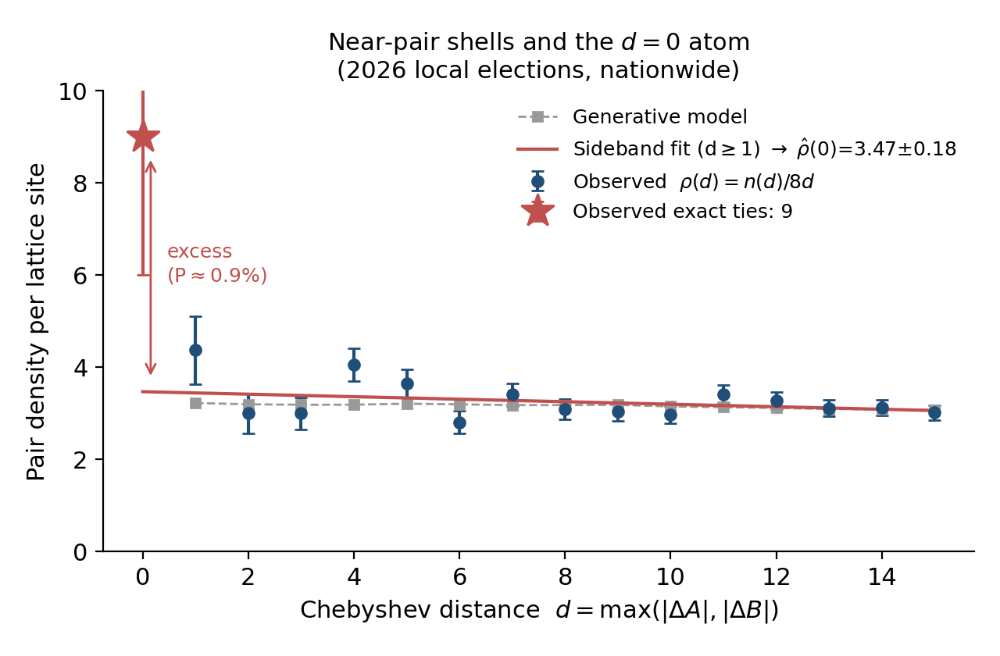
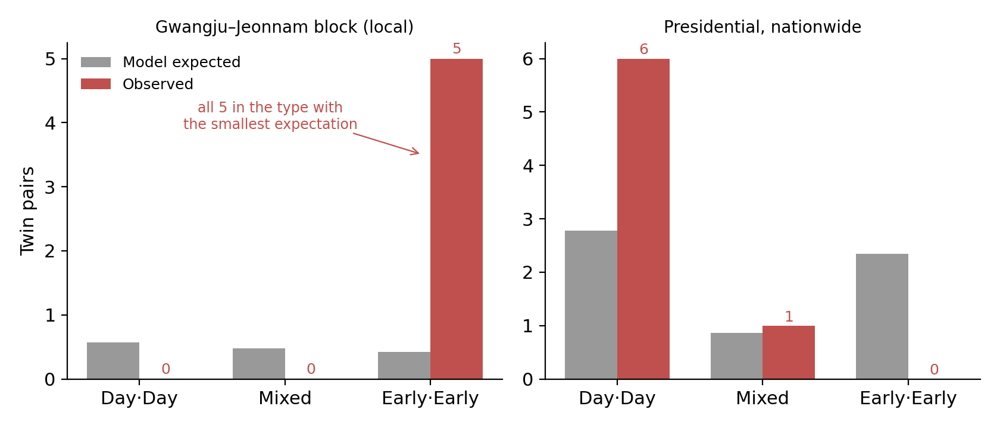
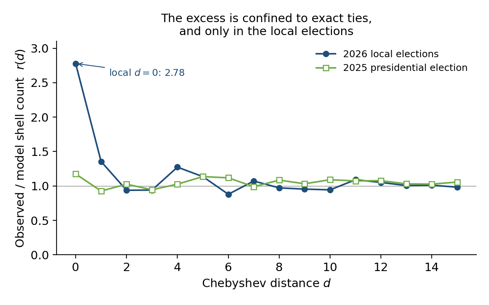

# 쌍둥이 개표단위: 선거 득표수 정확일치 이상(異常)의 모형무관 검정 — 2026년 지방선거와 2025년 대통령선거 사례

**Twin Counting Units: A Model-Free Test for Exact-Tie Anomalies in Election Returns, with Evidence from Two Korean Elections**

서상원 (Sangwon Seo) · sangwon0001@gmail.com

*초안 v1 — 2026-06-10. 데이터·코드: github.com/sangwon0001/election-simulator,
아카이브 DOI [10.5281/zenodo.20624233](https://doi.org/10.5281/zenodo.20624233) (전체 재현 가능)*

---

## 국문 초록

제9회 전국동시지방선거(2026) 시·도지사선거에서 서로 다른 두 개표단위(읍면동×투표유형)의
양대 후보 득표수가 정확히 일치하는 "쌍둥이"가 전국 9쌍 발견되어 선거 조작 논쟁이
재점화되었다. 본 연구는 중앙선거관리위원회 개표 자료 전수(17개 시·도, 7,000여 개표단위)를
이용해 이 현상의 통계적 희귀도를 측정한다. 첫째, 동별 실측 모수에 기반한 다항-이항 생성
모형으로 기대 쌍둥이 수 3.23, P(≥9) = 0.64%를 얻었다. 둘째, 이런 플러그인(parametric
bootstrap) 접근이 진짜 동일 모수 쌍의 일치확률을 차원당 1/√2로 과소평가함을 증명하고
(노이즈 이중계산 편향), 그 보완으로 입자물리의 범프 헌트에 해당하는 **모형무관 사이드밴드
추정**(근접쌍 격자 셸 카운트의 d→0 외삽)을 제안한다. 사이드밴드 추정은 기대 3.47±0.18,
P(≥9) = 0.94% [0.49, 1.66]로 생성 모형과 수렴하며, 관측 비조건부(ab-initio) 분포 기반
시뮬레이션도 동일한 ~1% 대역을 준다. 셋째, 사전지정된 반복 검증으로 제21대
대통령선거(2025)에 동일 방법을 적용한 결과 관측 7쌍 대 기대 6.02쌍(P = 39.7%)으로 초과가
재현되지 않았고, 근접쌍 밀도비 r(d)와 투표유형 구성까지 모형 예측과 일치했다. 직전
제8회 지방선거(2022)에서도 관측 7쌍 대 기대 4.65쌍(P = 19.0%), 유형 쏠림 없음으로
초과가 없어 "지방선거 일반의 성질" 가설 역시 기각된다. 넷째, 유형
분해 결과 지방선거 광주·전남의 5쌍은 세 유형 중 기대값이 가장 작은 관내사전투표 쌍에 전부
집중되어(조건부 P ≈ 0.2%, 사후통계) 이상이 "지방선거 × 광주전남 × 관내사전 × 정확일치"로
국재화됨을 보인다. 결론적으로 쌍둥이 현상은 (i) 매 선거 기저율로 발생하는 자연 현상이며,
(ii) 2026 지방선거의 초과는 약 1%의 꼬리 사건으로 "지극히 자연스럽다"는 평가와 "조작
증거"라는 주장 모두 정량적으로 기각되고, (iii) 잔여 이상의 정체(우연 대 비통계적 원인)는
단일 선거 자료로 식별 불가능하다. 부수적으로, 본 논쟁의 발단이 된 공개 분석의 핵심
가정("유사 쌍 비율 1%")이 실측 0.012%로 약 80배 과대함을 보인다.

**주제어**: 선거 포렌식, 정확일치, 생일 문제, 파라메트릭 부트스트랩, 범프 헌트, 사후 선택

## Abstract

In the 2026 Korean local elections, nine "twin" pairs of counting units — distinct
(neighborhood × vote-type) units whose two leading candidates received exactly identical
vote counts — reignited public election-fraud controversies. Using the complete official
returns (17 provinces, ~7,000 counting units), we measure how surprising this is. A
multinomial-binomial generative model with per-unit observed parameters yields an expected
3.23 twins, P(≥9) = 0.64%. We prove that such plug-in (parametric-bootstrap) procedures
underestimate the collision probability of truly identical-parameter pairs by 1/√2 per
dimension (a noise double-counting bias), and propose a **model-free sideband estimator** —
the bump-hunt analogue for exact ties, extrapolating lattice-shell near-pair counts to
distance zero — which gives 3.47±0.18 expected twins, P(≥9) = 0.94% [0.49, 1.66],
converging with the generative model; an unconditional distribution-based (ab-initio)
simulation agrees (~1%). A pre-specified replication on the 2025 presidential election
shows no excess (7 observed vs. 6.02 expected, P = 39.7%), with near-pair density ratios
and vote-type composition matching the model; the preceding 2022 local elections likewise
show no excess (7 vs. 4.65, P = 19.0%), rejecting mechanisms common to local elections. Type decomposition localizes the local-election
anomaly: all five Gwangju–Jeonnam twins fall in the early-voting pair type with the
*smallest* expectation (conditional P ≈ 0.2%, post hoc). Twins are a baseline natural
phenomenon; the 2026 excess is a ~1% tail event — too rare for "entirely natural," far too
common for "evidence of fraud" — and its residual identity is unidentifiable from a single
election. We also show that the key assumption of the public analysis that sparked the
debate (a 1% "similar-pair" rate) is ~80× too large (measured: 0.012%).

---

## 1. 서론

### 1.1 발단

2026년 6월 3일 제9회 전국동시지방선거 직후, 인천시장선거 관내사전투표에서 연수구
송도1동과 송도2동의 양대 후보 득표수가 (3030, 1440)으로 정확히 일치하고, 전남도지사선거
에서 유사한 "쌍둥이" 읍면동이 다섯 쌍 발견되면서 선거 조작 의혹이 제기되었다. 이에 대해
한 통계학자가 동전 던지기 모형과 생일 문제 논리로 "수학적으로 자연스러운 우연"이라는
공개 분석을 내놓았고[8], 반론과 재반론이 이어졌다. 논쟁의 양측 모두 정량적 근거가
취약했다: 의혹 측은 일치확률의 기저율을 계산하지 않았고, 반박 측은 논증의 하중을 받는
모수("유사한 쌍의 비율 1%")를 가정으로 대체했다.

### 1.2 연구 질문과 기여

본 연구의 질문은 단순하다: **관측된 쌍둥이 수는 매끄러운 확률 모형이 예측하는 기저율과
양립하는가?** 기여는 네 가지다.

1. **측정**: 선관위 개표자료 전수로 쌍둥이의 관측치와 기대치를 (모형 의존·비의존 양쪽으로)
   측정한다. 기존 공개 논쟁의 가정들을 실측값으로 대체한다.
2. **방법론적 경고**: 관측 모수를 재추첨하는 플러그인 시뮬레이션이 정확일치 확률을
   체계적으로 과소평가하는 조건과 크기(차원당 1/√2)를 증명한다 (명제 1).
3. **모형무관 추정**: 근접쌍 격자 셸 카운트의 영점 외삽으로 기대 쌍둥이 수를 추정하는
   사이드밴드 방법을 제안하고, 비순서쌍 정규화를 유도하며(명제 2), 시뮬레이션
   자가검증으로 타당성을 확인한다.
4. **반복 검증 설계**: "초과가 구조적이면 다른 선거에서도 나타난다"는 사전지정 예측을
   2025 대통령선거와 2022 지방선거로 검정하여 두 번 모두 기각한다. 이는 단일 선거
   사후분석의 순환성을 부분적으로 해소한다.

### 1.3 선행 연구

선거 부정의 통계적 탐지는 숫자 지문(digit-based) 검정[1,2], 투표율-득표율 결합분포의
지문[3], 정수 백분율 및 중복값 이상[4] 등으로 발전해 왔다. 본 연구의 대상인 "서로 다른
단위 간 다변량 득표수의 정확일치"는 [4]의 중복값 분석과 친족이나, (i) 2차원(양대 후보
동시 일치) 충돌을 다루고, (ii) 기대치를 모형이 아닌 데이터 자신의 근접쌍 밀도에서
외삽한다는 점에서 다르다. 후자는 고에너지물리의 범프 헌트(신호 영역의 기대 배경을
사이드밴드에서 내삽)와 동형이다. 사후 가설 선택의 위험에 대한 일반론은 [5]를 따른다.

## 2. 데이터

### 2.1 제9회 지방선거 (2026-06-03)

중앙선거관리위원회 선거통계시스템(info.nec.go.kr)의 시·도지사선거 개표단위별 자료를
Playwright 자동 크롤러로 17개 시·도 전수 수집했다. **개표단위**는 읍면동 × 투표유형
{관내사전투표, 선거일투표}로 정의하고 거소·선상, 관외사전, 재외투표는 동 단위로 분해되지
않으므로 제외했다. 양대 후보 (A, B)는 시·도별 총득표 상위 2인으로 식별했다. 광주광역시와
전라남도는 양대 후보가 동일인이므로(같은 선거구) 단일 블록으로 합본하여 시·도 교차쌍을
포함했다; 그 외 시·도는 후보가 달라 시·도 내부 쌍만 의미를 가진다. 최종 자료는 동
3,500여 개, 개표단위 약 7,100개이다.

데이터 규약상 주의점: 관내사전투표의 "선거인수"는 사전투표자 수와 사실상 동일하며
(동어반복), 동 전체 선거인수 = 관내사전 선거인수 + 선거일 선거인수이다.

### 2.2 제21대 대통령선거 (2025-06-03)

공공데이터포털의 개표결과 CSV(투표구 단위, 169,749행)를 사용했다. 지방선거와 동일한
단위 정의를 위해 선거일 투표구들을 읍면동으로 합산했다. 대통령선거는 전국이 동일
후보이므로 전체가 단일 블록이다: 동 3,554개 → 개표단위 7,108개, 비교 가능한 쌍 약
2.5×10⁷개. (A, B) = (이재명, 김문수).

### 2.3 관측된 쌍둥이

지방선거에서 9쌍이 관측되었다(표 1). 광주·전남 5쌍(시·도 교차 1쌍 포함), 인천·경북·
경남·전북 각 1쌍이다. 투표유형 구성은 관내사전·관내사전 6, 선거일·선거일 2, 혼합 1이다.

**표 1. 제9회 지방선거 쌍둥이 9쌍**

| 블록 | 단위 1 | 단위 2 | A | B | 유형 |
|---|---|---|---|---|---|
| 인천 | 연수구 송도1동 | 연수구 송도2동 | 3,030 | 1,440 | 사전·사전 |
| 광주전남 | 광산구 송정1동 | 고흥군 금산면 | 1,401 | 120 | 사전·사전 (교차) |
| 광주전남 | 장성군 북하면 | 함평군 엄다면 | 606 | 57 | 사전·사전 |
| 광주전남 | 여수시 삼일동 | 신안군 하의면 | 506 | 42 | 사전·사전 |
| 광주전남 | 화순군 이양면 | 강진군 병영면 | 444 | 46 | 사전·사전 |
| 광주전남 | 보성군 노동면 | 신안군 팔금면 | 356 | 42 | 사전·사전 |
| 경북 | 의성군 점곡면 | 영덕군 창수면 | 456 | 109 | 선거일·선거일 |
| 경남 | 하동군 양보면 | 거창군 위천면 | 385 | 180 | 선거일·선거일 |
| 전북 | 익산시 웅포면 | 진안군 성수면 | 186 | 150 | 사전·선거일 |

대통령선거에서는 7쌍이 관측되었다(선거일·선거일 6, 혼합 1, 사전·사전 0; §5).

### 2.4 자료 무결성 검증

표 1의 쌍둥이를 구성하는 18개 개표단위 전수에 대해 두 검사를 수행했다
(`src/verify_twins.py`). (i) **내부 산술 일치성**: 관내사전 + 선거일 = 계(선거인수·
투표수·A·B 각각) 및 A + B ≤ 투표수 — 전 단위 통과. (ii) **독립 수집 경로 교차 대조**:
전남의 9개 단위는 자동 크롤(Playwright)과 별도 세션의 수동 크롤이 모두 존재하여 두
경로의 수치를 대조 — 전 단위 일치. 따라서 본 자료는 선관위 공표값을 정확히 반영하며,
관측된 쌍둥이는 수집·전기(轉記) 단계의 인공물이 아니다. 공표 이전 단계(개표 현장 →
보고 시스템)의 오류 가능성은 공표 자료의 재독으로 배제할 수 없으며 물리적 검증의
영역이다(§7.2).

## 3. 방법

### 3.1 캐노니컬 생성 모형

동 $i$의 선거인수 $N_i$, 사전투표율 $r^e_i$, 잔여 대비 선거일투표율 $r^b_i$, 투표유형
$t \in \{e, b\}$별 양대 후보 지지율 $p^t_{A,i}, p^t_{B,i}$를 모두 동별 실측값으로 둔다.
한 번의 실현은

$$V^e_i \sim \mathrm{Bin}(N_i, r^e_i), \quad V^b_i \sim \mathrm{Bin}(N_i - V^e_i, r^b_i),$$
$$A^t_i \sim \mathrm{Bin}(V^t_i, p^t_{A,i}), \quad B^t_i \sim \mathrm{Bin}(V^t_i - A^t_i,\; p^t_{B,i}/(1-p^t_{A,i}))$$

로 생성하고, 전체 단위 집합에서 $(A, B)$가 동시에 일치하는 비순서쌍 수를 센다. 랜덤성은
(i) 누가 사전/선거일/기권에 속하는가(다항)와 (ii) 표의 갈림(이항)뿐이며 자유 모수는 없다.
블록별 시뮬레이션(R = 5×10⁴~2×10⁵, 블록별 독립 시드)의 합으로 전국 분포를 얻는다.

강건성 변형 — V 고정/랜덤, 분산계수 φ < 1, 모집단추출, 유한모집단 보정 — 은 결과를
바꾸지 않았다(§5.1). 또한 모수 간 상관을 의도적으로 절단한 **ab-initio 변형**을 두었다:
동 수만 고정하고 $N_i$ ~ 로그정규, 각 비율 ~ 베타(실측 적률 적합)에서 매 실현마다 전체
모수를 재추첨한다. 이는 "관측값 조건부"라는 비판이 적용되지 않는 비조건부 기저율이다.

### 3.2 플러그인 편향 (노이즈 이중계산)

캐노니컬 모형은 관측 모수를 진리로 꽂는 파라메트릭 부트스트랩이다. 이 절차는 정확일치
확률에 다음의 체계적 편향을 가진다.

**명제 1.** 두 단위가 진짜 동일 모수를 가질 때($X_i, X_j \sim \mathrm{Bin}(V, p)$ 독립),
관측치를 모수로 꽂은 재추첨 $X'_k \sim \mathrm{Bin}(V, X_k/V)$ 의 일치확률은 원 과정
대비 점근적으로

$$\frac{\mathbb{E}_{\text{data}}\,P(X'_i = X'_j \mid \text{data})}{P(X_i = X_j)} \;\longrightarrow\; \frac{1}{\sqrt{2}},$$

이고 $d$개 좌표의 동시 일치에서는 $2^{-d/2}$이다.

*증명 개요.* 정규근사에서 $D = X_i - X_j \approx \mathcal N(0, 2\sigma^2)$,
$\sigma^2 = Vp(1-p)$이므로 $P(D=0) \approx (4\pi\sigma^2)^{-1/2}$. 재추첨 차이는 관측차
$d$를 중심으로 $D' \mid d \approx \mathcal N(d, 2\sigma^2)$이고 $d$ 자체가
$\mathcal N(0, 2\sigma^2)$를 따르므로, 주변화하면 $D'$의 무조건부 분포는 분산이 두 배로
컨볼브된 $\mathcal N(0, 4\sigma^2)$가 된다. 영점 밀도비는 $\sqrt{2\sigma^2/4\sigma^2}
= 1/\sqrt2$. 좌표별 독립 근사에서 거듭제곱. ∎

수치 검증(이항 pmf 내적, V=2000, 동일쌍 50·비동일 100, 관측 반복 200): 동일쌍 비율
0.707(이론 1/√2), 비동일쌍 0.985(≈1). 반대로 진짜 모수 차이의 분포가 노이즈 척도에서
국소 평탄하면 편향이 사라진다 — 즉 편향의 크기는 자료의 미지 구조(동일평균 쌍의 존재량)에
달려 있어 모형 안에서는 보정할 수 없다. 이것이 다음의 모형무관 추정이 필요한 이유다.

### 3.3 모형무관 사이드밴드 추정

쌍 $(i,j)$의 체비셰프 거리 $d_{ij} = \max(|A_i - A_j|, |B_i - B_j|)$에 대해 셸 카운트
$n(d) = \#\{i<j : d_{ij} = d\}$를 정의한다. 쌍둥이는 $n(0)$이다.

**명제 2 (비순서쌍 정규화).** 순서쌍 차이 벡터의 격자점당 밀도 $c$가 원점 근방에서 국소
상수이면, $L_\infty$ 셸 $d \ge 1$의 격자점은 $8d$개이고 비순서쌍 카운트의 기대는
$\mathbb E\, n(d) = 4d\,c$, 원점은 $\mathbb E\, n(0) = c/2$이다. 따라서
$\rho(d) \equiv n(d)/(8d)$로 두면 $\mathbb E\, n(0) = \rho(0)$, 즉 **$\rho(d)$의
$d \to 0$ 외삽이 그대로 기대 쌍둥이 수**가 된다.

*증명 개요.* 비순서쌍은 차이 $\pm v$를 동일시한다. $v \ne 0$ 클래스는 격자점 2개를
흡수해 셸당 클래스 수가 $4d$, 원점 클래스는 순서쌍 2개(자기 반사)를 흡수해 기대가
$c/2$. 균일 합성 자료 검증: $n(0) = 87.8$ 대 외삽 $85.5$ (이론 88.9). ∎

추정은 $\rho(d)$, $d \in [1, 15]$에 포아송 최우추정으로 선형(보조적으로 2차) 추세를
적합하고 $\rho(0)$로 외삽한다. 표준오차는 포아송 재표집 부트스트랩(300회), 유의확률은
$\mathrm{Poisson}(\hat\rho(0))$ 꼬리로 계산한다. **자가검증**: 캐노니컬 시뮬레이션
산출물에 같은 외삽을 적용하면 시뮬레이션의 실제 $d=0$ 기대(3.24)를 외삽(3.27±0.01)이
복원한다.

이 추정량은 이항성·투표율 모형·분산계수 등 어떤 생성 가정도 쓰지 않는다. 유일한 가정은
"서로 다른 두 단위의 득표차 분포가 원점 근방 ±15표 척도에서 매끄럽다"이며, 이것이 바로
검정하려는 귀무가설이다. 진단량으로 관측/모형 셸 비 $r(d) = n_{\text{obs}}(d) /
n_{\text{sim}}(d)$를 함께 본다: $r(d)$가 전 구간 평탄하게 1을 넘으면 모형의 전반적
과평활(명제 1의 편향 실재)을, $d \ge 1$에서 $r \approx 1$인데 $r(0)$만 크면 정확일치
원자(atom)를 가리킨다.

### 3.4 반복 검증과 유형 분해

사전지정 예측을 둔다: *지방선거의 초과가 선거 일반의 구조적 메커니즘(모형 누락, 보고
관행, 인구 군집 등)이라면 기대치가 더 큰 대통령선거에서 비례적으로 더 큰 절대 초과
(기대 6.0 × 2.8배 ≈ 17쌍)가 관측되어야 한다.* 또한 기대 쌍둥이를 투표유형 쌍
{사전·사전, 선거일·선거일, 혼합}으로 분해해 관측 구성과 비교한다. 정확일치 기대밀도는
일차근사로 노이즈 척도와 무관하고 단위 평균들의 격자 패킹 밀도
$\propto 1/(\text{A축 퍼짐} \times \text{B축 퍼짐})$로 결정되므로, 유형 분해는 "쌍둥이가
어느 유형에서 나와야 하는가"에 대한 모형·데이터 양측의 예측을 제공한다.

## 4. 결과 I: 제9회 지방선거

### 4.1 전국 기저율과 유의확률

**표 2. 지방선거 전국 결과 (관측 9쌍)**

| 추정 경로 | 기대 쌍둥이 | P(≥9) |
|---|---|---|
| 캐노니컬 생성 모형 | 3.23 | 0.64% |
| 사이드밴드 선형 외삽 | 3.47 ± 0.18 | 0.94% [0.49, 1.66] |
| 사이드밴드 2차 외삽 | 3.64 ± 0.36 | 1.26% [0.33, 3.39] |

광주·전남 블록 단독(관측 5쌍): 캐노니컬 기대 1.47, P(≥5) = 1.74%; 사이드밴드 1.67±0.12,
P(≥5) = 2.75%; ab-initio(비조건부, 시·도별 적합/완전 풀링) 기대 1.26/1.33, P(≥5) =
0.99/1.26%. **조건부, 비조건부, 모형무관의 세 경로가 모두 ~1–3% 대역에 수렴한다.**

### 4.2 셸 진단: 초과는 정확일치에만 있는 원자

**표 3. 전국 근접쌍 셸: 관측 대 캐노니컬 시뮬레이션**

| d | 0 | 1 | 2 | 3 | 4 | 5 | 6 | 8 | 10 | 12 | 15 |
|---|---|---|---|---|---|---|---|---|---|---|---|
| 관측 | 9 | 35 | 48 | 72 | 130 | 146 | 135 | 198 | 238 | 315 | 362 |
| 시뮬 | 3.24 | 25.8 | 51.2 | 76.5 | 102.1 | 128.5 | 153.5 | 203.6 | 252.2 | 299.6 | 368.5 |
| r(d) | **2.78** | 1.36 | 0.94 | 0.94 | 1.27 | 1.14 | 0.88 | 0.97 | 0.94 | 1.05 | 0.98 |

**그림 1.** 지방선거 전국 근접쌍 셸. 관측 밀도 $\rho(d)$(오차막대: 포아송), 생성 모형
(회색), $d \ge 1$ 사이드밴드 적합의 $d = 0$ 외삽(적색 선). 관측 정확일치 9쌍(별표)과
외삽 3.47의 간극이 검정 대상 초과이다.

$d \ge 2$에서 $r(d)$는 0.88–1.27로 평탄하다(포아송 변동 범위): **모형은 "거의 일치"의
밀도를 정확히 재현한다.** 명제 1의 편향이 실재하려면 전제되어야 할 숨은 동일평균 쌍
모집단이 이 자료에는 없으며($r$이 전 구간 ~2였어야 함), 따라서 캐노니컬 기대 3.23은
신뢰할 수 있고 사이드밴드 3.47과의 일치는 그 독립 확인이다. 튀는 것은 $d = 0$ 하나로,
초과는 매끄러운 군집이 아니라 **정확일치 원자**다. 이는 양쪽 방향의 설명을 동시에
배제한다: 인구 동질성 같은 매끄러운 자연 메커니즘은 $d = 1$–15도 함께 부풀려야 하고
(흔적 없음), 모형 과평활 비판은 $r(d \ge 1) \approx 1$로 기각된다.

### 4.3 유형 분해: 초과는 기대가 가장 작은 유형에 몰려 있다

광주·전남 블록의 유형별 분해(표 4)는 직관과 반대 방향의 사실을 드러낸다. 선거일 단위가
사전 단위보다 작고(투표수 중앙값 796 대 1,147), 데이터 자신의 근접쌍도, 모형 기대도
선거일·선거일 쌍이 최다이다. 그러나 관측 5쌍은 전부 기대가 가장 작은 사전·사전이다.

**표 4. 광주·전남 유형 분해**

| | 선거일·선거일 | 혼합 | 사전·사전 |
|---|---|---|---|
| 모형 기대 쌍둥이 | 0.58 | 0.48 | **0.42** |
| 관측 근접쌍 (d=1–10) | 265 | 198 | 174 |
| **관측 쌍둥이** | 0 | 0 | **5** |

**그림 3.** 유형별 기대(회색) 대 관측(적색). 좌: 지방선거 광주·전남 — 관측 5쌍 전부가
기대 최소 유형에 집중. 우: 대통령선거 — 관측이 기대 구성과 부합.

총수를 조건으로 한 유형 검정: $P(\text{5쌍 전부 사전·사전} \mid \text{유형비 } 28.4\%)
= 0.284^5 \approx 0.19\%$. 이는 총수 초과(1.7%)와 별개의 추가 이상이며, 관측을 보고
자른 사후 통계이므로 탐색 자유도(유형 3, 블록 선택)를 감안해 보수적으로 읽어야 하나
그 할인 후에도 무시하기 어렵다. 종합하면 이상은 **지방선거 × 광주전남 × 관내사전 ×
정확일치**의 4중으로 국재화된다. "압승 × 농촌 소단위라서 자연스럽다"는 설명은 같은
논리로 선거일 쌍이 더 많아야 하므로 유형 분해를 통과하지 못한다.

## 5. 결과 II: 반복 검증 — 2025 대통령선거와 2022 지방선거

### 5.1 제21대 대통령선거 (2025)

전국 단일 블록(단위 7,108개)에 동일 방법을 적용했다.

**표 5. 대통령선거 결과 (관측 7쌍)**

| 추정 경로 | 기대 | P(≥7) |
|---|---|---|
| 캐노니컬 생성 모형 | 6.02 | 39.7% |
| 사이드밴드 선형 외삽 | 6.44 ± 0.24 | 46.3% |

**그림 2.** 셸 비 $r(d)$ — 두 선거 비교. 대통령선거(녹색)는 $d = 0$ 포함 전 구간이
1 근방인 반면, 지방선거(청색)는 $d = 0$에서만 2.78로 이탈한다.

셸 비 $r(d)$는 $d = 0$ 포함 전 구간 0.93–1.17로 평탄하다. 유형 분해(모형 기대:
선거일·선거일 2.78, 사전·사전 2.35, 혼합 0.86; 관측: 6, 0, 1)도 모형과 부합한다
($P(\text{사전 0/7} \mid 39\%) \approx 3\%$). 사전지정 예측 — 구조적 메커니즘이면
~17쌍 — 은 명확히 기각된다($P(\ge 17 \mid 6.0) \approx 10^{-4}$).

대통령선거의 유형 구성이 지방선거와 역전된 것(사전 6/9 → 사전 0/7)은 패킹 밀도 원리의
자연스러운 귀결이다: 쌍둥이는 특정 투표유형이 아니라 "득표수가 작게 뭉치는 곳"을
따라간다. 전남 지방선거에서는 압승(B 점유 8%)이 사전 B축을 42–57표에 압축했고,
대통령선거에서는 호남 농촌 면의 선거일 단위가 그 역할을 했다. 이는 "사전투표 고유의
이상"이라는 통념을 데이터로 반박하는 동시에, §4.3의 국재화(왜 하필 기대 최소 유형인가)를
선거 일반의 성질로는 설명할 수 없음을 재확인한다.

### 5.2 제8회 지방선거 (2022) — "지방선거 일반" 가설 기각

남는 가설은 보고 체계 등 지방선거에 공통된 원인이다. 직전 지방선거(2022-06-01,
공공데이터포털 xlsx, 동 3,510 × 17개 시·도 — 2022년엔 동일 양대후보 시·도가 없어 합본
불요)에 동일 파이프라인을 적용했다.

**표 6. 세 선거 비교**

| 선거 | 관측 | 캐노니컬 기대 | P(≥관측) | 사이드밴드 | P(≥관측) |
|---|---|---|---|---|---|
| **2026 지방선거** | **9** | 3.23 | **0.64%** | 3.47 ± 0.18 | **0.94%** |
| 2025 대통령선거 | 7 | 6.02 | 39.7% | 6.44 ± 0.24 | 46.3% |
| 2022 지방선거 | 7 | 4.65 | 19.0% | 5.33 ± 0.21 | 28.7% |

2022년의 7쌍은 기대 4.65 대비 평범하고(P = 19.0%), 유형 구성도 혼합 4 · 사전·사전 2 ·
선거일·선거일 1로 쏠림이 없으며(근접쌍의 사전·사전 비율 ~30%와 부합), 발생 위치는
전남 3 · 전북 2 · 경남 1 · 충북 1 — 2026과 같은 압승×소단위 조건이 같은 곳에서 같은
방식으로 작동하되 d = 0 원자만 없다. r(d)는 d ≥ 1에서 1.03–1.18로 모형이 근접쌍을 약
8% 과소생성하나(사이드밴드 기대가 캐노니컬보다 높은 이유) 결론에는 영향이 없다.

따라서 이상은 **2026 지방선거에만** 존재한다. 같은 통계량, 같은 파이프라인으로 세 선거를
검사한 결과가 19%, 40%, 0.6–0.9%다. 지방선거 공통의 보고 관행·집계 체계류 가설은
기각되고, 남는 설명은 사후선택된 일회성 우연(세 선거 중 하나가 ~1%일 확률 자체가 ~3%로
우연 범위) 또는 2026년에 한정된 원인뿐이다.

## 6. 공개 논쟁의 재평가

발단이 된 공개 분석[8]은 (쌍 수) × (유사 쌍 비율) × (일치확률|유사)의 분해를 사용했다.
이 골격은 본 연구 사이드밴드의 손계산 판으로 구조적으로 옳다. 문제는 모수의 출처다.

**인천.** 동전 모형 일치확률 0.903%(재검산 일치)와 생일 문제 쌍수는 정확하나, "조합 중
약 1%가 유사하다면"은 가정이다. 실측(셸 카운트 역산)은 **0.012%로 약 82배 과대**다.
인천 관내사전 158개 단위의 근접쌍($d \le 10$)은 단 2개다. 결과적으로 기대 쌍둥이는
주장된 0.84가 아니라 0.0137(캐노니컬) = 0.0146(사이드밴드)이고, $P(\ge 1) = 1.4\%$다.
송도 쌍둥이는 득표 규모(3030/1440) 기준 전국에서 단독으로 가장 드문 쌍이다. 다만
송도1·2동은 투표수 4,546/4,539의 사실상 모수 쌍둥이(동질 신도시 단지)로, 일치확률의
*조건부* 인자에 관한 한 원 분석에 유리한 사례다.

**후속 보론.** "$p_1 = p_2$ 가정이 일치확률을 부풀린다"는 지적은 명제 1의 거울상으로
타당하다. 그러나 이를 확인했다는 공개 코드 검증은 두 단위가 추첨된 $p$를 **공유**하는
구현이어서($X_1, X_2 \sim \mathrm{Bin}(n, p)$, $p$ 한 번 추첨) $p_1 = p_2$를 재가정한
순환 확인이다(0.901% ≈ 원 모형 0.906%). 각 단위가 독립 사후분포에서 $p$를 추첨하도록
고치면 분산이 3배가 되어 0.524%(√3 감소)다. 어느 쪽이든 차수가 같으므로 *조건부* 인자에
대한 "결론은 대략 같다"는 좁은 의미로 성립하지만, 일치확률은 진짜 지지율 차에 극도로
민감해($\Delta p$ = 1%p에서 0.54%, 3%p에서 0.008%) "유사"의 실질 정의가 "지지율
±1.5%p 이내 + 규모 거의 동일"임을 함의한다 — 그리고 그런 쌍의 실측 비율이 0.012%다.
즉 논쟁은 대체로 옳은 조건부 인자(0.5–0.9%)를 다듬는 동안, 80배 틀린 무조건부
인자(유사 쌍 비율)를 방치했다.

**광주·전남.** 원 분석의 정성적 방향 — $n$이 작을수록, $p$가 1에 가까울수록 일치확률
증가, 쌍 수는 $k^2$ — 은 모두 옳으며, 실제로 광주전남 기대(1.47)가 인천(0.014)의
약 100배인 이유를 정확히 짚는다. 그러나 정량 계산 없이 "자연스러운 우연"이 선언되었다.
실측 유의확률은 1.0–2.8%로, "지극히 자연스러움"(수십 % 함의)도 "있을 수 없는 우연"도
지지되지 않는다.

## 7. 논의

### 7.1 해석

세 가지 사실이 확립된다. (i) 쌍둥이는 기저율 현상이다 — 대통령선거 7쌍은 모형 예측과
완전히 일치한다. (ii) 2026 지방선거의 9쌍은 그 기저율 대비 약 1%의 꼬리 사건이며, 이
숫자는 방법론 스펙트럼 전체(조건부/비조건부/모형무관)에서 안정적이다. (iii) 초과는
정확일치에만 있는 원자이고 4중으로 국재화되어 있다.

반복 검증 둘(2025 대선, 2022 지선)이 모두 무초과로 끝나면서 "선거 일반" 및 "지방선거
일반"의 구조적 메커니즘은 기각되었고, 이상은 2026 지방선거 한 회에 국한된다.

이로부터 무엇을 추론할 수 있는가. 빈도주의 유의확률 1%는 조작의 사후확률이 아니다.
조작 가설은 이 패턴 — 결과가 60%p 차로 확정된 지역의 수십 표 단위 정확일치 — 을 딱히
예측하지 않으므로 우도비가 1 근처이고, 사전확률과 독립 증거가 부재한 상황에서 사후확률은
거의 움직이지 않는다. 동시에, 매 선거 대중이 검토하는 통계량이 수십 개라는 점에서(선택
효과[5]) 액면 1%의 실효 놀라움은 더 작다. 반대 방향으로, "지극히 자연스러운 우연"이라는
수사도 표본확률 주장으로서는 약 40배 과장이다(§6). 자료가 허락하는 정확한 문장은
다음이다: **드문 일이 맞고(~1%), 드묾은 조작의 증거가 아니다.**

잔여 이상(원자의 정체)에 대한 남은 가설은 둘이다 — 사후선택된 우연, 또는 지방선거·
관내사전에 국한된 비통계적 원인(보고·전기 단계의 인공물 포함). 후자는 통계 외부의
수단으로 판별 가능하며(§7.3), 이는 통계의 한계가 아니라 통계가 수색 범위를 좁혀준
결과다.

### 7.2 한계

(1) 단일 선거 쌍의 사후 분석이라는 근본 한계: 가설(쌍둥이라는 통계량 자체)이 자료에서
나왔다. 대통령선거 검정은 사전지정으로 이를 부분 보완하나, 지방선거 고유 원인은 남는다.
(2) 동이 1회 관측되므로 동내 분산($\phi$)은 식별 불가능하다. (3) 유형 국재화(§4.3)는
사후 통계이며 제시한 유의확률은 탐색 보정 전 액면가다. (4) 자료 무결성 검증(§2.4)은
수집·전기 단계의 인공물을 배제하지만, 선관위 공표 이전 단계의 오류는 공표 자료의
재독으로 검증할 수 없다 — 이는 물리적 재검표의 영역이다. (5) 2022 지방선거
분석(§5.2)은 2026·2025 결과를 본 뒤 수행되었으나, 가설("지방선거 일반인가")과
파이프라인은 분석 전에 명시되어 있었다.

### 7.3 향후 작업

(a) 국회의원선거(소선거구 단위) 확장, (b) 사이드밴드 추정의 일반화 — 임의 차원 다변량
정확일치, 이질적 노이즈 척도 하의 셸 가중.

## 8. 결론

2026년 지방선거의 쌍둥이 개표단위 9쌍은 매끄러운 확률 모형 기준 약 1%(전국 0.64–0.94%,
광주전남 1.0–2.8%)의 꼬리 사건이다. 이 수치는 관측 조건부 생성 모형, 비조건부 분포
모형, 그리고 어떤 생성 가정도 없는 사이드밴드 외삽에서 동일하게 얻어지며, 2025년
대통령선거(P = 40%)와 2022년 지방선거(P = 19%) 어느 쪽에서도 초과는 재현되지 않았다. 정확일치는 매 선거 발생하는 자연 현상이고,
2026년의 초과는 드물지만 가능한 우연의 범위에 있으며, 그 잔여의 최종 정체는 통계 외부의
검증(원본 대조, 물리적 재검표)에 속한다. 공개 논쟁의 두 진영이 공유한 오류는 동일했다:
측정 가능한 양을 측정하지 않은 것이다.

---

## 참고문헌

[1] Beber, B. and Scacco, A. (2012). What the numbers say: A digit-based test for
election fraud. *Political Analysis*, 20(2), 211–234.

[2] Mebane, W. R. (2008). Election forensics: The second-digit Benford's law test and
recent American presidential elections. In *Election Fraud: Detecting and Deterring
Electoral Manipulation*, Brookings Institution Press.

[3] Klimek, P., Yegorov, Y., Hanel, R., and Thurner, S. (2012). Statistical detection of
systematic election irregularities. *PNAS*, 109(41), 16469–16473.

[4] Kobak, D., Shpilkin, S., and Pshenichnikov, M. S. (2016). Integer percentages as
electoral falsification fingerprints. *Annals of Applied Statistics*, 10(1), 54–73.

[5] Gelman, A. and Loken, E. (2014). The statistical crisis in science. *American
Scientist*, 102(6), 460–465.

[6] Grimes, D. R. (2016). On the viability of conspiratorial beliefs. *PLOS ONE*, 11(1),
e0147905.

[7] Littlewood, J. E. (1953). *A Mathematician's Miscellany*. Methuen, London.

[8] 허명회 (2026). 3,030표와 1,440표로 2개 동이 일치: 이런 일치가 우연히 가능하다고?
공개 소셜미디어 게시물 및 보론, 2026년 6월.

[9] 중앙선거관리위원회. 선거통계시스템 개표결과. info.nec.go.kr (2026년 6월 접근).

[10] 공공데이터포털. 중앙선거관리위원회 대통령선거 개표결과 (2025-06-03). data.go.kr.

---

## 부록 A. 재현

모든 수치는 공개 저장소의 스크립트로 재현된다: `twin_model.py`(캐노니컬 모형),
`analyze_national.py`(지선 전국·셸·사이드밴드), `analyze_president.py`(대선),
`analyze_local2022.py`(2022 지선, §5.2), `bias_demo.py`(명제 1 수치검증),
`type_decompose.py`(유형 분해), `abinitio_sim.py`(비조건부 변형),
`verify_twins.py`(자료 무결성, §2.4), `paper/make_figs.py`(그림).
크롤 원자료와 정제 데이터 동봉.

## 부록 B. 감사의 글 및 AI 사용 고지

본 연구의 분석 설계 토론, 코드 작성, 원고 초안 작성에 Anthropic의 Claude(Fable 5)가
사용되었다. 모든 분석의 검증 책임과 최종 결론은 저자에게 있다.
